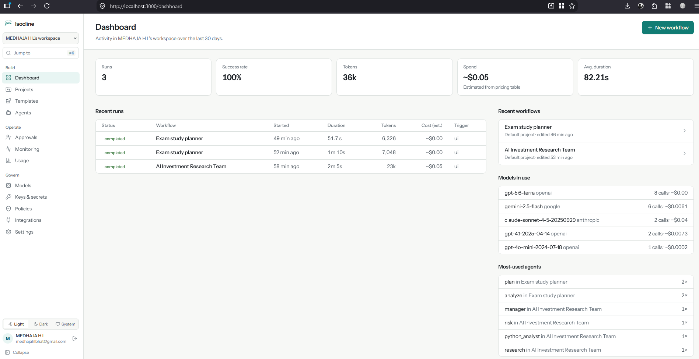
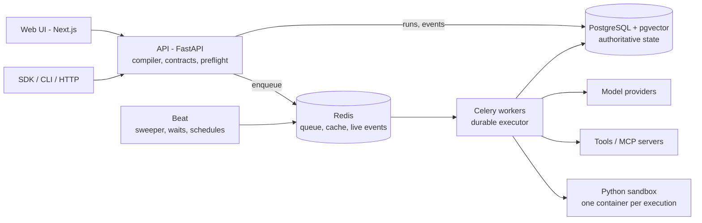

# Isocline

**Open-source control plane and durable execution harness for production AI agents.**

Build visually. Run with any model. Self-host the runtime.



## Why Isocline?

Building an agent is becoming easy. Operating agentic workflows reliably is not: model calls fail and rate-limit,
workers crash mid-run, humans take days to approve things, side effects need undoing, and generated code has to run
somewhere safe.

Isocline is a self-hosted runtime for those problems, with a visual builder on top:

- **Visual workflow composition** with typed contracts between nodes
- **Durable execution** on PostgreSQL: parallel DAGs, heartbeats, crash recovery, checkpoints, rerun from any node
- **Human-in-the-loop and durable waits** (approval, timer, callback, event) that hold no worker while waiting
- **Saga-style compensation** for side effects, run in reverse order
- **Sandboxed Python** in disposable, network-less containers
- **Any model**: OpenAI, Anthropic, Gemini, OpenRouter, Ollama, any OpenAI-compatible server, plus a deterministic test provider
- **MCP** tools, **RAG** on pgvector, **webhook and schedule triggers**
- **REST API, Python SDK and CLI**

## Quick start

Requirements: Docker with Compose v2, ~4 GB free RAM (see [self-hosting](docs/self-hosting.md)).

```bash
git clone <repository-url> isocline && cd isocline
cp .env.example .env
docker compose up --build
```

Open **http://localhost:3000** and create the first account (it becomes the administrator). API docs:
**http://localhost:8000/api/docs**.

No API key needed to start: the deterministic **local test provider** (`local_test`) runs every workflow without a
model. It is a test fixture, not a language model: it returns labelled placeholder output. Add real keys to `.env`
(`OPENAI_API_KEY=...`, `ANTHROPIC_API_KEY=...`, `GEMINI_API_KEY=...`, `OLLAMA_BASE_URL=...`) or in the UI under
**Keys & secrets**.

Your first workflow: open the *Default project* → **Import** → `examples/01-simple-agent/workflow.json` → **Run** →
watch the trace. Or from a terminal:

```bash
pip install -e sdk/python
export ISOCLINE_URL=http://localhost:8000 ISOCLINE_TOKEN=isc_pat_...   # Settings → Access tokens
python examples/run_example.py examples/production-agent-demo --approve
```

## 53 ready-to-run templates

Start from a working multi-agent workflow instead of a blank canvas. Open **Templates**, pick your role, choose a model:

| For | Examples |
|---|---|
| Students | exam study planner, concept explainer + quiz, essay feedback coach, research paper explainer |
| Job seekers | resume tailor for a job, cover letter writer, interview prep coach, offer comparison + negotiation email |
| Interviewers | structured interview kit, candidate scorecard (typed JSON, human sign-off), take-home designer |
| HR | inclusive job descriptions, resume screening where a human decides, 30-60-90 onboarding, review drafts, policy answers |
| Content creators | YouTube package (script, titles, thumbnails, SEO), SEO blog pipeline, repurpose one piece everywhere, 30-day calendar |
| Managers | 1:1 prep, weekly status report, project risk review (RAID log), meeting notes → action items |
| Traders & investors | stock research brief, earnings call analyzer, portfolio risk check (Python), trading journal review — research, never advice |
| CEOs & founders | board/investor update, competitive landscape, strategy options memo, customer interview synthesis, pitch narrative |
| CTOs & engineers | architecture decision review, build vs buy, incident postmortem, vendor evaluation, 3-reviewer code review, bug triage |
| Sales, marketing, research, teaching, support, freelancing | account research + outreach, campaign briefs, literature reviews, lesson plans, ticket replies, client proposals |

Parallel specialists, typed outputs, web research, sandboxed Python and human approval where a person should decide —
the same runtime features, packaged for everyday work. Full list: [docs/templates.md](docs/templates.md). Every template
is created and run end to end in CI.

## Engineering highlights

Each of these is exercised by an automated test or a recorded live check (see [Verification](#verification)).

- **Durable workflow execution backed by PostgreSQL.** Every node run, output and event is persisted; Redis is only the
  queue and cache. A Redis `FLUSHALL` loses nothing: the sweeper re-enqueues runs from PostgreSQL.
- **Worker crash recovery.** Workers heartbeat; a `SIGKILL`ed worker's run is resumed by another worker, reusing
  completed node outputs (completed nodes are not re-executed).
- **Durable HITL without blocked workers.** A waiting run is persisted as `WAITING` and releases its worker (measured:
  0 active worker tasks while waiting). Approvals, timers, callbacks and events resume it through a conditional update
  in PostgreSQL, so concurrent resumes cannot double-fire.
- **Typed graph contracts.** Ports carry types (`Text`, `Number`, `JSON<schema>`, `Table`, `Artifact<csv>`, custom
  JSON-Schema types); incompatible edges are rejected at compile time and outputs are checked at run time.
- **Parallel DAG execution** with a per-run parallelism ceiling.
- **Checkpoint-based replay.** Automatic checkpoints (before side effects and approvals, after expensive model calls)
  plus explicit ones; resume a failed run from a checkpoint, or rerun from any node reusing upstream outputs.
- **Saga-style compensation.** Side-effecting HTTP steps register a compensating action; on failure they run in
  reverse order, each passing the policy engine.
- **Isolated Python execution** in disposable Docker containers: no network, read-only root, all capabilities dropped,
  CPU / memory / PID / file-size / wall-clock limits, optional gVisor. See its [limits](docs/sandbox.md).
- **Multi-provider model abstraction** behind one registry, with fallbacks and recovery rules.
- **MCP integration** over streamable HTTP with an explicit per-server tool allowlist.
- **pgvector RAG** with lexical fallback embeddings, or Ollama / OpenAI-compatible embeddings.
- **OpenTelemetry instrumentation**, exported only when you configure an endpoint.

## Architecture



Details: [docs/architecture.md](docs/architecture.md) and the [design documents](docs/design/).

## Features

| Area | What you get | Docs |
|---|---|---|
| Builder | canvas, minimap, undo/redo, autosave, notes/groups, variables, typed ports, JSON import/export | [workflows](docs/workflows.md), [variables](docs/variables.md), [contracts](docs/contracts.md) |
| Nodes | inputs (text, JSON, file, URL, chat), outputs (text, JSON, file, report, API), agent, 7 tools, condition, router, parallel, merge, loop, retry, transform, human approval, sub-workflow, timer/callback/event waits, webhook/schedule/event/file triggers | [nodes](docs/nodes.md) |
| Runtime | durable DAG executor, recovery, checkpoints, compensation, execution limits | [durable execution](docs/durable-execution.md), [checkpoints](docs/checkpoints.md), [compensation](docs/compensation.md) |
| Models | provider registry, fallbacks, structured JSON-schema output, editable model catalog and pricing, token/cost tracking | [models](docs/models.md), [providers](docs/providers.md) |
| Tools | web search, HTTP (SSRF-protected), Python, calculator, file reader, JSON, knowledge search, MCP | [tools](docs/tools.md), [MCP](docs/mcp.md) |
| Knowledge | upload, extraction, chunking, reprocessing, pgvector + lexical retrieval | [knowledge](docs/knowledge.md) |
| Operate | webhook / schedule / event / file triggers, node playground, run inspector, monitoring | [triggers](docs/triggers.md) |
| Develop | REST API + OpenAPI, Python SDK, CLI | [API](docs/api.md), [SDK](docs/sdk.md), [CLI](docs/cli.md) |

The complete list of what this repository contains is in
[docs/oss-scope.md](docs/oss-scope.md).

## Example workflow

`examples/production-agent-demo`: research → parallel financial and risk analysis with typed JSON output → merge
(checkpoint) → human sign-off (durable wait) → report artifact. Runs on the test provider; a multi-provider variant uses
Ollama, OpenAI and Anthropic. Ten smaller examples cover one feature each: [examples/](examples/).

## Supported providers

| Provider | id | Configure |
|---|---|---|
| OpenAI | `openai` | `OPENAI_API_KEY` (or UI) |
| Anthropic | `anthropic` | `ANTHROPIC_API_KEY` |
| Google Gemini | `google` | `GEMINI_API_KEY` or `GOOGLE_API_KEY` |
| OpenRouter | `openrouter` | `OPENROUTER_API_KEY` |
| Ollama | `ollama` | `OLLAMA_BASE_URL` (default: the Docker host) |
| Any OpenAI-compatible server (vLLM, LM Studio, llama.cpp, LiteLLM, ...) | `openai_compatible` | `OPENAI_COMPATIBLE_BASE_URL`, `OPENAI_COMPATIBLE_API_KEY` |
| Deterministic test provider | `local_test` | built in; `ISOCLINE_ENABLE_TEST_PROVIDER=false` to hide it |

Keys never appear in workflow JSON or exports. Adding a provider: [docs/contributing/adding-a-provider.md](docs/contributing/adding-a-provider.md).

## Self hosting

Seven long-running services (web, api, worker, beat, python-sandbox, postgres, redis) plus two one-shot build/setup
services. Secrets are generated on first start and kept in the `secrets` volume. Ports bind to `127.0.0.1`. Read
[docs/self-hosting.md](docs/self-hosting.md) before exposing an installation (TLS, sign-up policy, backups, the
sandbox's Docker socket) and [docs/configuration.md](docs/configuration.md) for every setting.

## Python SDK

```python
from isocline_sdk import Isocline

client = Isocline(base_url="http://localhost:8000", token="isc_pat_...")
project = client.projects.list()[0]["id"]
run = client.workflows.run("Company research", {"company": "Acme Corp"}, project=project).wait()
print(run.status, run.output)
```

[docs/sdk.md](docs/sdk.md)

## CLI

```bash
isocline login --url http://localhost:8000 --token isc_pat_...
isocline workflows list
isocline validate examples/01-simple-agent/workflow.json
isocline run <workflow-id> --input '{"company": "Acme Corp"}' --stream
isocline runs get <run-id> --nodes
isocline artifacts get <artifact-id> -o report.md
```

[docs/cli.md](docs/cli.md)

## API

OpenAPI at `/api/openapi.json`, Swagger UI at `/api/docs`. Session auth for the UI, personal access tokens
(`Authorization: Bearer isc_pat_...`) for automation. [docs/api.md](docs/api.md)

## Extending Isocline

Providers, tools, node types, MCP integrations, embedding providers and document loaders each have one registration
point. Guides: [adding a provider](docs/contributing/adding-a-provider.md), [adding a tool](docs/contributing/adding-a-tool.md),
[adding a node](docs/contributing/adding-a-node.md).

## Security

Local-first defaults: ports on 127.0.0.1, generated secrets, sign-up closed after the first account, SSRF protection
with DNS pinning, network-less sandbox, no telemetry. The trust boundaries and known limitations are in
[docs/security.md](docs/security.md); report vulnerabilities as described in [SECURITY.md](SECURITY.md).

## Verification

What has been verified, and how:

- **Automated suites** (`make test`): API unit, integration and product tests (SQLite), SSRF security tests, template
  tests, sandbox controller tests, SDK/CLI tests.
- **Migrations on PostgreSQL 16**: fresh install of the schema baseline (tables, pgvector index, audit trigger).
- **Templates**: `scripts/template_check.py` creates all 53 templates and runs each to completion.
- **Live stack** (PostgreSQL + Redis + Celery worker + beat): `scripts/durability_check.py` — worker `SIGKILL`
  mid-node, API/worker/Redis restarts during an approval, Redis data loss during a timer and before queue pickup,
  callbacks, checkpoint restore, rerun from node, saga ordering (recorded in `docs/verification/release-3.3.0.txt`);
  `scripts/smoke_check.py` — SDK, CLI, import/export, playground, sandbox, knowledge base, webhook and schedule
  triggers; every example via `examples/run_example.py`.
- **Benchmarks**: [benchmarks/](benchmarks/) — measured numbers with their environment.

Not verified by the maintainers at release time: `docker compose up` itself end to end, and the Python sandbox in Docker
mode (the environment used for release verification had no Docker; the live checks used the sandbox's development
process mode). CI runs `docker compose build` and the live checks on every push.

## Known limitations

- Per-node overhead is dominated by durable bookkeeping (~100 ms per node on a 1-vCPU reference machine); very wide
  fan-outs of trivial nodes are bookkeeping-bound. See [benchmarks](benchmarks/README.md).
- Execution is at-least-once per node across crashes: a node that was running when its worker died runs again.
  Side-effecting tools should be idempotent or declare compensation. There is no exactly-once guarantee.
- The sandbox's Docker mode needs the host Docker socket (root-equivalent); plain Docker is not a hardened boundary
  against kernel exploits — use gVisor (`SANDBOX_RUNTIME=runsc`) or a dedicated VM for untrusted code. See [sandbox](docs/sandbox.md).
- MCP: streamable-HTTP servers only (no stdio, no OAuth). The MCP client checks the endpoint for SSRF but does not pin DNS.
- Default embeddings (`hashing`) are lexical, not semantic; configure Ollama or an OpenAI-compatible embedding model.
- A node paused for a tool-call approval re-runs from its start once approved (model calls are repeated and counted).
- Single queue for all runs; resource classes are recorded but not routed.

## Contributing

See [CONTRIBUTING.md](CONTRIBUTING.md). Good first issues: providers, tools, document loaders, examples, docs, UI polish.

## License

[Apache License 2.0](LICENSE). See [NOTICE](NOTICE) and [dependency licenses](docs/dependency-licenses.md).
