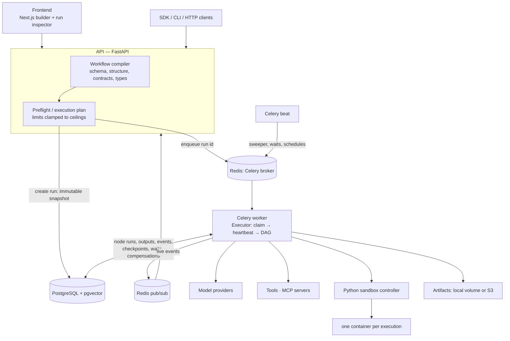

# Architecture

## State: PostgreSQL is authoritative, Redis is disposable

| PostgreSQL | Redis |
|---|---|
| runs (status, heartbeat, totals, immutable graph snapshot and limits), node runs (inputs, outputs, attempts, tokens, cost), run events, checkpoints, wait states, approvals, compensation actions, artifacts metadata, knowledge chunks + embeddings, triggers | Celery queue messages, live event fan-out for the UI, rate-limit counters, caches |

Losing Redis loses queued messages and live-event streams, nothing else: the sweeper re-enqueues `queued`/`resuming`
runs from PostgreSQL, and the UI falls back to reading events from the database. This was tested with `FLUSHALL`
([verification](verification/release-3.3.0.txt)).

## Run lifecycle

`queued → running → (waiting ⇄ resuming → running) → completed | failed | cancelled`

1. **Create.** The API compiles and validates the graph, clamps limits to server ceilings, snapshots graph, policy
   rules and custom types into the run, and enqueues the run id.
2. **Claim.** A worker atomically claims the run (conditional update on status and heartbeat), so duplicate queue
   messages are harmless. It heartbeats every `ISOCLINE_WORKER_HEARTBEAT_SECONDS`.
3. **Execute.** The executor walks the DAG; ready nodes run concurrently up to the run's parallelism limit. Before
   running a node it loads prior node runs: completed nodes are reused, never re-executed.
4. **Wait.** A waiting node persists a wait state and the run returns `waiting`; the worker is released.
5. **Resume.** An approval decision, callback, event, or the beat's timer check flips `waiting → resuming` with a
   conditional update and enqueues the run; any worker continues from step 2.
6. **Recover.** The beat sweeper re-enqueues runs whose heartbeat is older than `ISOCLINE_WORKER_STALE_SECONDS`
   (up to 3 recovery attempts, then the run fails with `worker_lost`), and re-enqueues `queued`/`resuming` runs whose
   message was lost.

## Queues

`runs` (execution, evaluations), `ingest` (document ingestion), `maintenance` (beat tasks). Every task is routed
explicitly; the default queue is `maintenance`; the worker must consume all three.

## Node execution

For each node: resolve `{{...}}` inputs → check input contracts → (agent) build messages, retrieve knowledge, call the
model with tools in a loop under budget → check output contract / JSON schema → persist output and usage → register
compensation (side-effecting tools) → checkpoint where applicable → emit events. Failures go through the node's retry
policy and recovery rules (retry, fallback model, switch provider, repair, reduce context, route to an error edge,
escalate to a human, fail).

## Boundaries

- **Sandbox**: user Python never runs in API or worker processes; see [sandbox.md](sandbox.md).
- **Outbound HTTP**: SSRF-checked and DNS-pinned; see [security.md](security.md).
- **Secrets**: resolved server-side at call time; redacted from traces; never in workflow JSON.

Design rationale: [durable execution](design/durable-execution.md), [checkpointing](design/checkpointing.md),
[sagas](design/saga-compensation.md), [sandbox](design/python-sandbox.md), [contracts](design/typed-workflow-contracts.md),
[providers](design/model-provider-abstraction.md).
